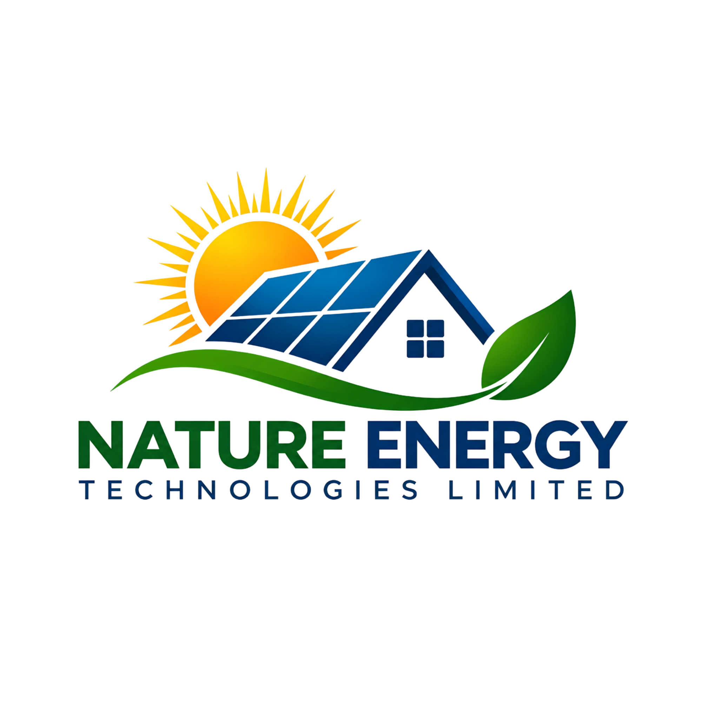

# Nature Energy Technologies Limited



The official website for **Nature Energy Technologies Limited**, a renewable-energy and power-solutions company focused on solar systems, inverters, batteries, backup power, installation, maintenance, repairs and energy consultation.

The website presents the company as a clean, practical and technically minded energy partner for homes, offices, businesses, commercial properties and other essential operations.

## Website

The site is a responsive seven-page corporate website built with semantic HTML5, modern CSS3 and vanilla JavaScript.

### Pages

| Page | File | Purpose |
| --- | --- | --- |
| Home | `index.html` | Company introduction, core solutions, process and calls to action |
| About Us | `about.html` | Company direction, mission, vision, values and approach |
| Products | `products.html` | Solar panels, inverters, batteries and complete system categories |
| Services | `services.html` | Installation, design, diagnostics, maintenance, repairs and support |
| Projects | `projects.html` | Portfolio structure for approved residential, commercial and storage case studies |
| Why Choose Us | `why-us.html` | Practical reasons to work with Nature Energy and the delivery process |
| Contact | `contact.html` | Contact information placeholders and quote-request form |

## Features

- Responsive layouts for desktop, tablet and mobile screens
- Official Nature Energy Technologies Limited logo from `logo.png`
- Light, brand-led visual system using green, blue, yellow and white
- Mobile off-canvas sidebar navigation with backdrop and keyboard dismissal
- Scroll-responsive sunrise-to-sunset visual element
- Section reveal animations using GSAP and ScrollTrigger
- Smooth scrolling using Lenis where motion preferences allow it
- Product and project category filters using vanilla JavaScript
- Accessible form labels, semantic sections, keyboard-friendly controls and reduced-motion support
- Lazy-loaded below-the-fold imagery
- Unique page titles, descriptions and canonical URLs
- No frontend framework or build step required

## Technology

- HTML5
- CSS3
- Vanilla JavaScript
- [Remix Icon](https://github.com/Remix-Design/RemixIcon)
- [GSAP](https://gsap.com/)
- [GSAP ScrollTrigger](https://gsap.com/docs/v3/Plugins/ScrollTrigger/)
- [Lenis](https://github.com/darkroomengineering/lenis)
- [Google Fonts](https://fonts.google.com/): Space Grotesk and Poppins

Third-party libraries are loaded from CDNs. The core content remains readable and the main navigation remains usable without JavaScript.

## Project structure

```text
.
├── index.html
├── about.html
├── products.html
├── services.html
├── projects.html
├── why-us.html
├── contact.html
├── logo.png
├── css/
│   └── style.css
└── js/
	└── main.js
```

## Run locally

The site can be opened directly through `index.html`. A local HTTP server is recommended so asset paths and browser behaviour match deployment more closely.

### Python

```powershell
python -m http.server 8080
```

Open [http://localhost:8080](http://localhost:8080).

### Node.js

```powershell
npx serve .
```

Use the local URL printed by the command.

## Before launch

The following business details should be supplied and reviewed before publishing:

- Confirmed phone number and WhatsApp number
- Official business email address
- Office address and business hours
- Approved company history, statistics and certifications
- Confirmed product availability and technical specifications
- Approved project case studies, locations, imagery and outcomes
- Official social media profile URLs
- Production form endpoint or backend integration
- Final image licensing and hosting decisions

The website deliberately uses clearly labelled placeholders where these facts were not provided. It does not present invented statistics, certifications, partnerships, project history or product specifications as factual claims.

## Quote form

The form on `contact.html` currently performs browser-side validation and displays a local confirmation message. It does not send email or store submissions.

Connect the form marked with `data-quote-form` to the company’s chosen backend, CRM, email service or form-processing endpoint before launch. Confirm spam protection, privacy handling and success/error states as part of that integration.

## Brand principle

**Clean Energy. Brighter Tomorrow.**

Green represents nature and trust, yellow represents solar energy, blue represents technology and white represents clarity.
